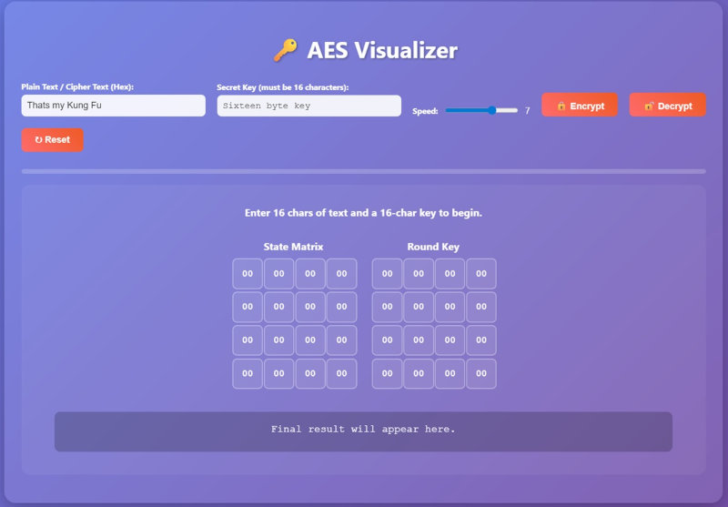

# CipherFlow 🔑

CipherFlow is an interactive web-based tool designed to help students, developers, and the curious understand how modern encryption algorithms work through clear, step-by-step visualizations. Instead of just reading theory, you can see the data transformation process in action.

> **Note:** This project is currently a work in progress. The core visualizer is functional, but blog pages and additional content are actively being developed.



## ✨ Features

***Step-by-Step Visualization:** Watch algorithms like AES transform data in real-time. Follow every substitution, permutation, and key mix to truly understand the process, not just the theory.
***Interactive Controls:** Input your own custom data and keys. Pause, rewind, and inspect the state at any stage to see instantly how changing a single bit can affect the entire outcome.
***In-Depth Explanations:** Each visual step is paired with clear, concise explanations. Understand the "why" behind the math, not just the "how," with insights linked directly to the on-screen action.

## 🛠️ Tech Stack

***Framework:** [Astro](https://astro.build/) - For a fast, content-focused frontend.
***Styling:** [Tailwind CSS](https://tailwindcss.com/) - For modern, utility-first styling.
***Visualizations:** [D3.js](https://d3js.org/) - For dynamic and data-driven visualizations.
***Deployment:** Ready for deployment on platforms like Netlify, Vercel, or GitHub Pages.

## 🚀 Getting Started

To get a local copy up and running, follow these simple steps.

### Prerequisites

* Node.js (version 18.x or later)
* npm or pnpm or yarn

### Installation & Setup

1. Clone the repository:

    ```bash
    git clone https://github.com/powergr/cipherflow-visualizer.git
    ```

2. Navigate to the project directory:

  ```bash
    cd cipherflow-visualizer
    ```
3. Install the dependencies:
    
    ```bash
    npm install
    ```

### Running the Project

To start the local development server, run:

```bash
npm run dev
 ```

Open your browser and navigate to `http://localhost:4321` to see the application.

## 🤝 Contributing

Contributions, issues, and feature requests are welcome! Feel free to check the [issues page](https://github.com/powergr/cipherflow-visualizer/issues).

## 📄 License

This project is licensed under the MIT License. See the `LICENSE` file for details.
