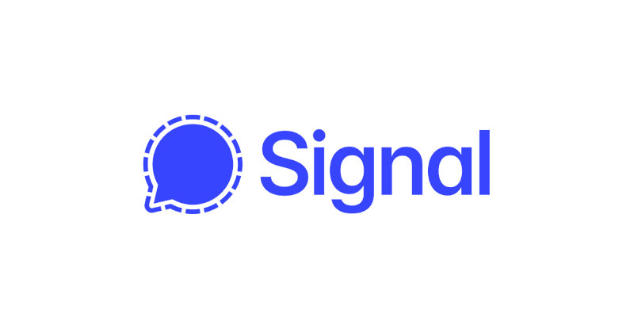
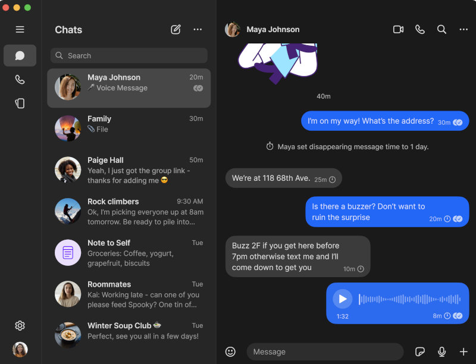

An in-depth look at the Signal protocol, the gold standard for end-to-end encryption, will be provided in this article.

### Table of Contents

* [Introduction](#introduction)
* [History of the Algorithm](#history-of-the-algorithm)
* [A Detailed Guide for How it Works](#a-detailed-guide-for-how-it-works)
* [Limitations and Criticisms](#limitations-and-criticisms)
* [Latest News](#latest-news)
* [Comparison to Similar Algorithms](#comparison-to-similar-algorithms)
* [FAQ Section](#faq-section)
* [Reference Section](#reference-section)

### Introduction

The Signal Protocol is a modern, open-source cryptographic protocol that provides end-to-end encryption for voice calls, video calls, and instant messaging conversations. Developed by Open Whisper Systems, it is widely recognized as the gold standard for secure messaging. The protocol is designed to prevent third parties, including the service provider, from accessing the content of communications. Its strength lies in its use of the Double Ratchet Algorithm, pre-keys, and a unique key management system.

### History of the Algorithm

The Signal Protocol has its roots in the efforts of security researcher Trevor Perrin and Moxie Marlinspike, the founder of Signal. Here's a brief timeline of its development:

**2013:** The protocol was first introduced in the TextSecure app, which was the predecessor to the Signal app.

**2014:** The protocol was updated and the Double Ratchet Algorithm was introduced, a key component that provides for both forward and backward secrecy.

**2016:** The protocol was adopted by WhatsApp, making it one of the most widely used end-to-end encryption protocols in the world.

**2017:** The protocol was also adopted by Facebook for its Messenger's "Secret Conversations" feature and by Google for its "Allo" messaging app.

**Present:** The Signal Protocol is used by a variety of messaging apps, including Signal, WhatsApp, and Skype, to secure the communications of billions of users.

### A Detailed Guide for How it Works

The Signal Protocol's security is based on a combination of several cryptographic techniques. Here's a simplified breakdown of how it works:

1. **Initial Key Exchange:** When two users start a conversation, they exchange their public keys. This initial key exchange is protected by a long-term identity key that is verified using a fingerprint or QR code.

2. **The Double Ratchet Algorithm:** This is the core of the Signal Protocol. The "ratchet" is a mechanism that generates a new encryption key for every message. The "double" part comes from the fact that it uses two ratchets:
    **The Root Ratchet:** This ratchet is updated with every message and generates a new chain of keys.
    **The Sender and Receiver Ratchets:** These ratchets are used to generate the actual encryption keys for each message. This ensures that even if one key is compromised, it cannot be used to decrypt past or future messages.

3. **Pre-keys:** To allow for asynchronous communication (i.e., sending a message to someone who is offline), the Signal Protocol uses pre-keys. These are a batch of public keys that are uploaded to the server. When a user wants to send a message to an offline user, they can use one of these pre-keys to encrypt the message.

4. **Forward and Backward Secrecy:** The Double Ratchet Algorithm provides both forward and backward secrecy. This means that if a user's key is compromised, an attacker cannot decrypt past messages (forward secrecy) or future messages (backward secrecy).

#### An Analogy to Understand the Double Ratchet

To make this easier to understand, think of the two ratchets like two different security mechanisms working together:

**The Symmetric-Key Ratchet (The "Turning Wrench"):** Imagine this like a wrench that only turns in one direction. Each time a message is sent, the wrench clicks forward to a new position, creating a new, unique key for that specific message. If an attacker steals the key for one message, they can't turn the wrench backward to find the keys for previous messages. This provides **forward secrecy**.

**The Diffie-Hellman Ratchet (The "Key-Swapping Handshake"):** Periodically, the two people in the conversation perform a "Diffie-Hellman handshake," which is like securely creating and exchanging a brand new secret code. This process completely renews the underlying key material. So, even if an attacker somehow managed to compromise the "wrench," the next "handshake" would lock them out entirely. This provides **post-compromise security**, also known as "self-healing."

### Limitations and Criticisms

To provide a balanced view, it's important to acknowledge some of the protocol's and the app's limitations:

**Centralized Architecture:** While the protocol itself is decentralized in its key management, the Signal service relies on centralized servers run by the Signal Foundation. This means the service could be a single point of failure if it were to go offline, though the server operators still cannot read message content.

**Historical Phone Number Requirement:** For years, Signal required a phone number for registration, a privacy concern for users who did not want to expose their personal number. However, this has been addressed by the recent introduction of usernames, which allows users to connect without sharing phone numbers.

**Metadata Leakage Potential:** No system is perfect. While the protocol is designed to minimize metadata (like who is talking to whom and when), determined adversaries might be able to infer some information through sophisticated traffic analysis. Signal continues to develop features like "Sealed Sender" to combat this.

**Usability vs. Security Trade-offs:** Some of Signal's most important security features come at the cost of convenience. For example, Signal does not offer cloud backups of chats (on iOS) because that would mean entrusting user data to third-party servers like Apple's iCloud, creating a potential weak point.

### Latest News

As of mid-2025, the Signal Protocol remains at the forefront of secure communication technology. Here are the most significant recent developments:

**Full Rollout of Quantum-Resistant Encryption:** Signal has completed the rollout of its PQXDH protocol. It is now required for all new chats, replacing the older X3DH protocol. This upgrade provides crucial protection against "Harvest Now, Decrypt Later" (HNDL) attacks, where encrypted data is stored today with the intent of breaking it in the future with powerful quantum computers.

**Introduction of Usernames for Phone Number Privacy:** Addressing a long-standing user request, Signal now allows users to create unique usernames. This enables them to connect with others without having to share their phone numbers, a major step forward for user privacy.

**Formal Verification of PQXDH:** Reinforcing its commitment to security, the PQXDH protocol underwent a formal analysis by security researchers from Inria and Cryspen. The review found no major vulnerabilities and helped refine the public specification, demonstrating the protocol's robustness.

**Protection Against OS-Level Threats:** Signal has introduced new protections, like the "Screen Security" feature on its desktop app, which helps prevent other applications or OS-level features from capturing screenshots of your conversations.

### Comparison to Similar Algorithms

| Feature | Signal Protocol | Telegram (MTProto) | Apple iMessage | PGP/GPG |
| :--- | :--- | :--- | :--- | :--- |
| **Default E2EE** | **Yes** (All communications) | **No** (Only for "Secret Chats") | **Yes** (Between Apple devices) | **No** (User-enabled) |
| **Key Management** | **Automatic & Seamless** | Automatic | Automatic | **Manual** (Users must generate, exchange, and verify keys) |
| **Forward Secrecy** | **Yes** (New key for every message) | In Secret Chats | Yes | **No** (A compromised key can decrypt past messages) |
| **Backward Secrecy** | **Yes** (Self-healing after compromise) | In Secret Chats | Yes | No |
| **Group Chat** | **Yes** (Highly secure) | Yes (Standard groups are not E2EE) | **Yes** (Secure, but proprietary) | Limited & Complex |
| **Plausible Deniability**| **Yes** (Cannot prove message authorship to a third party) | No | No | No (Digital signatures provide non-repudiation) |
| **Open Source** | **Yes** (Protocol and client code are public) | Client-side is open, but server and protocol are proprietary | **No** (Closed, proprietary protocol) | Yes |
| **Data/Metadata Privacy**| **Minimal** (Designed to store almost no metadata) | Collects more metadata; standard chats are stored on servers. | Collects metadata; iCloud backups can be a weak point. | N/A (Depends on implementation) |

### FAQ Section

**Q: Is the Signal Protocol truly secure?**

A: Yes, the Signal Protocol is widely considered to be the most secure and robust end-to-end encryption protocol publicly available. However, it is important to remember that no system is 100% secure, and security also depends on user practices and the security of the device itself.

**Q: Can the Signal Protocol be broken?**

A: There are no known practical attacks that can break the protocol's encryption. Breaking it with current technology would require an enormous amount of computing power. With the recent upgrade to the quantum-resistant PQXDH protocol, Signal is now also proactively protecting against future threats from quantum computers.

**Q: What is the difference between Signal and WhatsApp?**

A: While both apps use the Signal Protocol for end-to-end encryption, their parent organizations and philosophies are very different. Signal is run by a non-profit foundation funded by donations, with a sole focus on privacy. Its code is fully open-source for public scrutiny. WhatsApp is owned by Meta (Facebook), a for-profit company that collects extensive user metadata for its business model.

**Q: What does "Plausible Deniability" mean?**

A: Plausible deniability means that you cannot definitively prove to a third party that someone sent a specific message. This is because the authentication key is a shared secret between the sender and receiver. In theory, the receiver could have forged the message themselves. This protects users by making it difficult to use their messages against them, and it contrasts sharply with systems like PGP which use digital signatures to provide concrete, undeniable proof of authorship.

**Q: Who runs Signal and how is it funded?**

A: Signal is developed by the Signal Messenger LLC, which is owned by the non-profit Signal Technology Foundation. It was started with a major loan from WhatsApp co-founder Brian Acton and operates entirely on donations from users. It has no advertisers or shareholders, ensuring its mission remains aligned with user privacy, not profit.

**Q: What is the difference between Signal the app and the Signal Protocol?**

A: The Signal Protocol is the core encryption technology—think of it as the secure engine. The Signal app is the messenger application that is built using that engine. The protocol is so strong and respected that its open-source code is also used by other companies, like WhatsApp and Google, to power the end-to-end encryption in their own messaging services.

### Reference Section

**Signal Protocol Official Documentation:** [https://signal.org/docs/](https://signal.org/docs/)

**A Deep Dive into the Signal Protocol:** [https://www.securemessagingapps.com/](https://www.securemessagingapps.com/)

**A Formal Security Analysis of the Signal Messaging Protocol** [https://www.iacr.org/](https://eprint.iacr.org/2016/1013.pdf)
